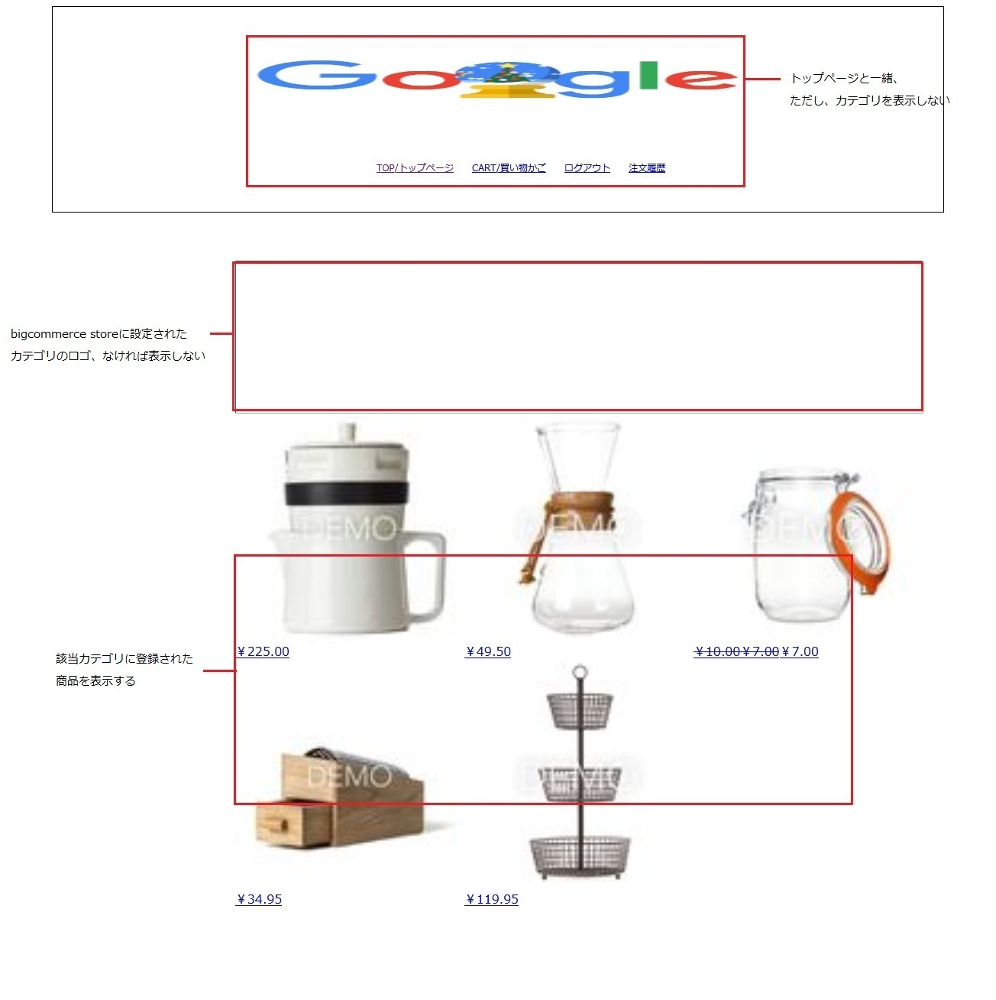

### テスト環境作成

###### Macの場合
- git をインストールする
  - $ brew update
  - $ brew install git
- openJDKをインストールする
  - https://qiita.com/spaciba_h_t/items/c96e96be99596b0a9fe4
- leiningen をインストールする  
  - brew install leiningen  

###### Windowsの場合
- git をインストールする
  - https://qiita.com/toshi-click/items/dcf3dd48fdc74c91b409
- openJDKをインストールする
  - https://qiita.com/ryo-sato/items/87d05021fcc0519e8828
- leiningenをインストールする
  - https://raw.githubusercontent.com/technomancy/leiningen/stable/bin/lein.bat をローカルにダウンロードする
  - lein.bat self-install  
 ※失敗の場合、https://github.com/technomancy/leiningen/releases/download/2.9.2/leiningen-2.9.2-standalone.zip を手動ダウンロードして、lein.bat と同じフォルダに解凍してください。lein.bat所在フォルダのパスを通す
  - 詳細は http://antibayesian.hateblo.jp/entry/20120122/1327236946

### 起動
- git clone https://github.com/zheng-jiwei/ec-site-bigcommerce.git
- cloneされたフォルダーに移動する
- `lein ring server-headless` でサーバーを起動してください。  
- ブラザーで `http://localhost:8080/index.html` をアクセスしたら、サイトの表示ができます。

***
### 実装機能
- トップページ

- カテゴリページ

- 商品ページ

- カート表示ページ

- 住所入力ページ

- 支払い情報入力ページ

- 注文完了ページ

- 注文履歴

- 会員ログイン

***

### 問題
- 注文確定ボタンをクリックして、「"code"= 30102, "title"="The payment was declined."」エラーが出る場合、注文商品の数を変更して再度試してください。（原因は確認中です）
