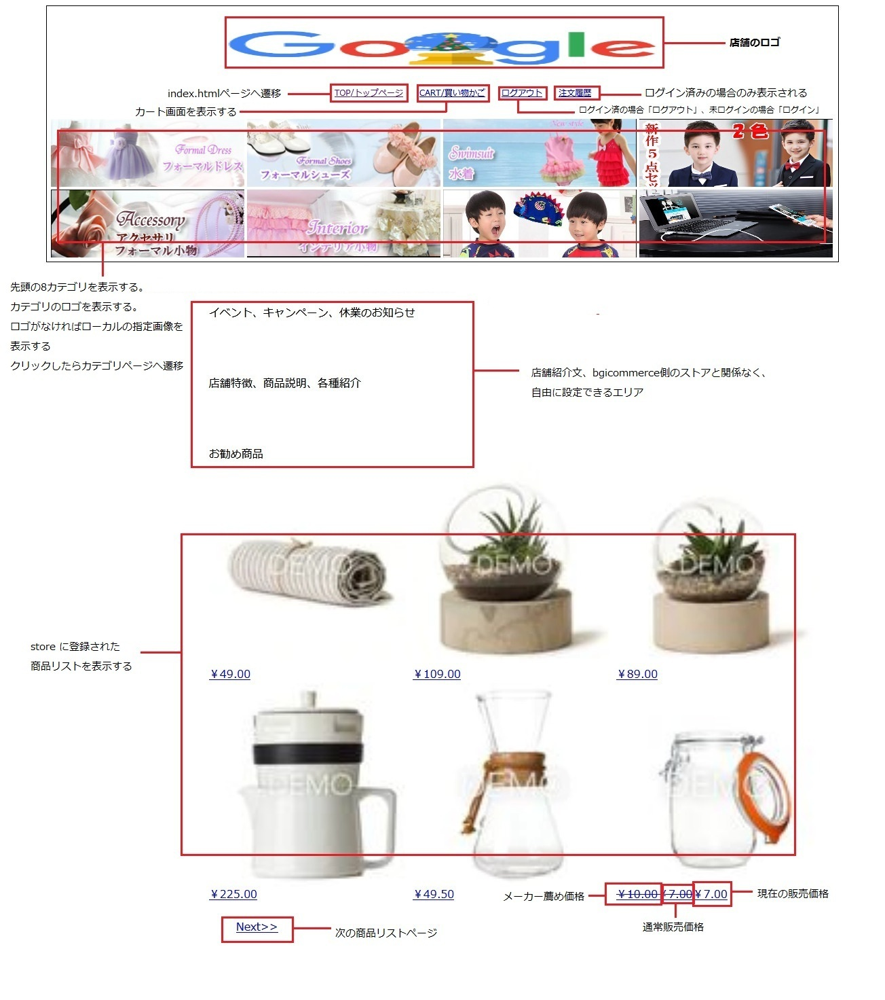
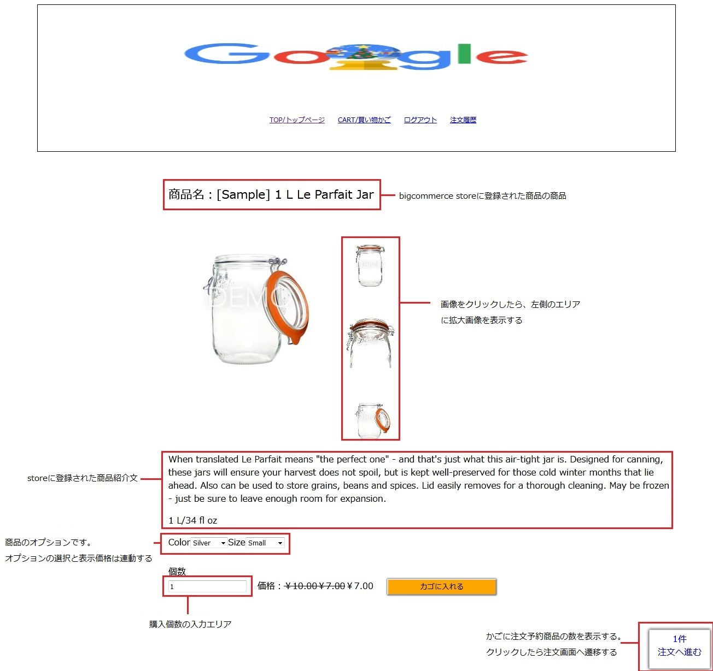
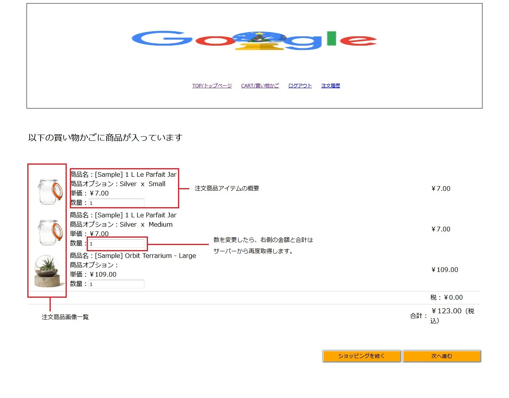

### テスト環境作成

###### Macの場合
- git をインストールする
  - $ brew update
  - $ brew install git
- openJDKをインストールする
  - https://qiita.com/spaciba_h_t/items/c96e96be99596b0a9fe4
- leiningen をインストールする  
  - brew install leiningen  

###### Windowsの場合
- git をインストールする
  - https://qiita.com/toshi-click/items/dcf3dd48fdc74c91b409
- openJDKをインストールする
  - https://qiita.com/ryo-sato/items/87d05021fcc0519e8828
- leiningenをインストールする
  - https://raw.githubusercontent.com/technomancy/leiningen/stable/bin/lein.bat をローカルにダウンロードする
  - lein.bat self-install  
 ※失敗の場合、https://github.com/technomancy/leiningen/releases/download/2.9.2/leiningen-2.9.2-standalone.zip を手動ダウンロードして、lein.bat と同じフォルダに解凍してください。lein.bat所在フォルダのパスを通す
  - 詳細は http://antibayesian.hateblo.jp/entry/20120122/1327236946

### 起動
- git clone https://github.com/zheng-jiwei/ec-site-bigcommerce.git
- cloneされたフォルダーに移動する
- `lein ring server-headless` でサーバーを起動してください。  
- ブラザーで `http://localhost:8080/index.html` をアクセスしたら、サイトの表示ができます。

***

### bigcommerce storeの設定
- ストアアカウントの作成
  - https://www.bigcommerce.com/essentials/free-trial
- APIアカウント作成
　- bigcommerce storeにログイン
  - 左側のメニュー > Advanced Settings > API Accounts で画面を開いて、ボタン「create API account」 >  「create v2/v3 API token」をクリックする
  - 「OAuth Scopes」にある項目はすべて最大権限を付与して（modifyがあればmodify、なければ readonly、login、management、create）、「save」をクリックします。
　- 出てきた情報は config.json にある関連するkeywordの値と入れ替えする（shop_cacheはAPI PATHの後ろから2番目セグメントの値です）
- 配送地域の設定
  - 管理画面左側のメニュー > Store Setup > Shipping を開きます。
  - Add shipping zone > add a country zone をクリックして、任意の国を選択して submit します。
  - default shipping rules 中に選択された国が出てきて、configureをクリックします
  - ship by をONにして、defaultは by weight が表示されて、Default shipping cost に任意の数字を入れてOKです。Rangesエリアは重さ区間の送料を適当に追加して、submitで保存します。
  - 配送地域は複数追加できます。追加された情報は注文の配送先画面に選択できます。
  - Real-time shipping quotesは、UPSやFedexと契約必要があり、テストしていません。
- 支払いの設定
  - 管理画面左側のメニュー > Store Setup > Payments を開きます。
  - Stripe をONにして、（stripe のログインが必要です）Stripe Settings に test mode をチェックして save します。
  - Stripe のアカウント作成は　https://dashboard.stripe.com/register　からできます。（作成した後も銀行口座など入力が必要ですが、仮の情報を入力でも問題なさそうです）

***  

### 商品登録とサイト画面の反映
- デフォルト商品
  - ストア作成に伴って、デフォルトのdemo商品は13件、6カテゴリがあります。
  - default 商品のオプション情報は問題があります（存在しないcolorがcolorの選択肢に出てくる）ので、操作の際エラーの可能性があります。
- 商品登録
  - 管理画面左側のメニュー「product」> 「add」で新規商品登録画面を開く
  - 必須の項目(「\*」ついている項目)のみでもいいですので、入力終わったら「save」します。(Categories の項目は Shop All と Garden を選択する前提で説明します)
  - 管理画面左側のメニュー「product」> 「product categories」を開いて、garden カテゴリの編集画面に「Category Image」を追加してください。
- ECSiteで確認
  - `http://localhost:8080/index.html` をアクセスする
  - 
  - カテゴリ Garden をクリックしたら下記の画面へ遷移します。
  - 

***
### 実装機能
- トップページ

- カテゴリページ

- 商品ページ

- カート表示ページ

- 住所入力ページ

- 支払い情報入力ページ

- 注文完了ページ

- 注文履歴

- 会員ログイン

***

### 問題
- 商品をcartに入れた後、cartから商品情報を取得する時に商品単価は小数点以後がある場合、数値が切り上げるようになります。（商品単価は円の場合のみ、米ドルの場合問題がありません）
- 商品のretail_price, priceとsale_priceの中に、graphqlを利用する場合priceの数値は正しくないです。server-to-server APIを利用する場合、正しく取れますが取得する情報が足りなくて数回bigcommerceサーバーにrequestする必要がありますので、現在はgraphqlの方法で実装しています。
- 注文確定ボタンをクリックして、「"code"= 30102, "title"="The payment was declined."」エラーが出る場合、注文商品の数を変更して再度試してください。（原因は確認中です）
